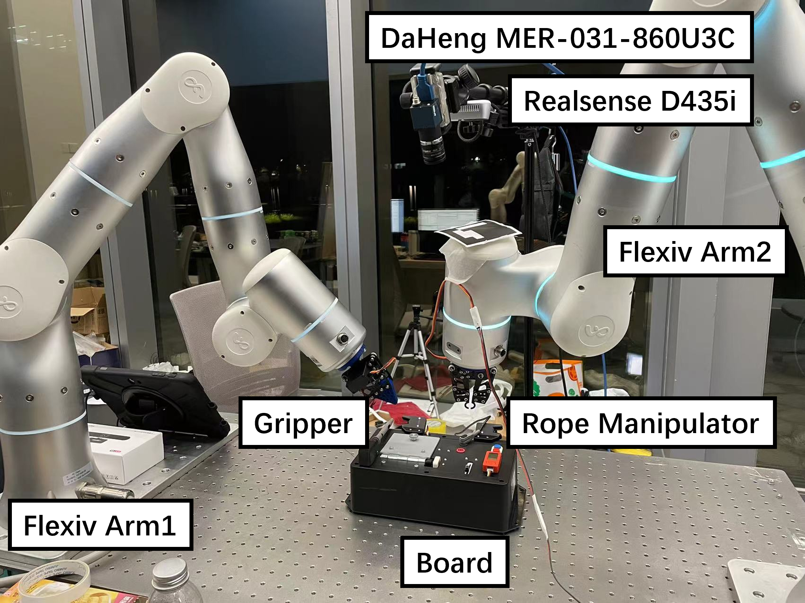
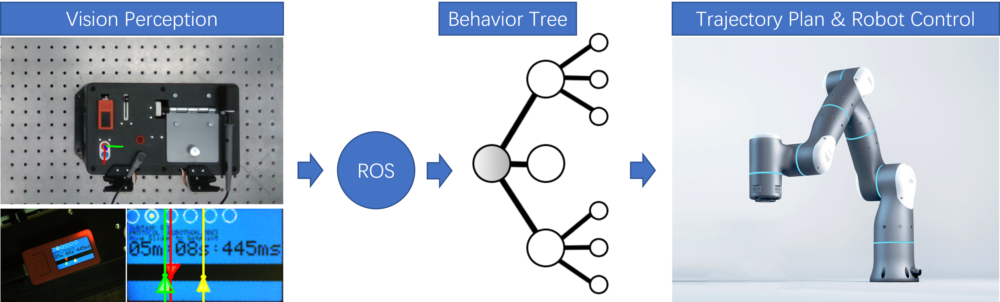

# Robothon2023 Grand Challenge CURM Team Report
<p align="center">
Authors: Shengzi Wang, Hongbin Lin, 
Yunxi Tang, Bin Li
</p>
<p align="center">
The Chinese University of Hong Kong
</p>

## Hardware Setup
The robot platform on which the Robothon Grand Challange was tested is shown in the figure below.
<p align="center">
  
</p>

The setup consists of:
- two 7-Dof Flexiv robot arms mounted on a table. The robots have force sensors in each joint which allows to control the force applied by the end-effector on the environment;
- two customized two-finger grippers are mounted on the end-effector of the robots. One is used to operate the board tasks and the other one is
 used to manipulate the rope. Note that the grippers don't have force sensor inside;
- a vision system consists of an rgbd camera and a rgb camera. Specifically, the RealSense D435i (depth ignored here), and a DaHeng imaging device MER-031-860U3C are used to 
detect the board pose and the indicator in the screen respectively. Note that these two vision perception task are runned separately to ensure the real-time performance;

## Software Setup
Our software framework is developed using ROS (Robot Operating System). The overall framework is presented in the
figure below. The vision system first localizes the board by filtering the red region of the board,
i.e, the screen, the red button/port. Besides, the screen is also extracted through color filter and then
detect the indicator position. Then the sequence of board tasks are executed by the robot.
<p align="center">
  
</p>

### Vision System 
#### Board Localization:
- Online pose estimation (~45 fps+): we detect the center of red button/red port as the reference 
to determine the board pose. Traditional computer vision techniques such as contour detection/morphological processing/
color segmentation, etc. are utilized to achieve the robust and steady pose estimation.

#### Screen Perception
- Online visual perception (~50 fps+): we use the similar techniques above and focused on the accurate color segmenation. 
Specifically, we first use the red color to localize the screen region and detect the four corners of the screen. Then we
warped the screen region into the normal rectangular region. We further segment the relevant color such as red/yellow/cyan 
and use the triangular fitting to find the peak position. 

Here a hand-eye calibration was performed with a eye-to-hand configuration. The calibration is performed using the 
ArUco markers. Then with the real-time relative board pose in the camera frame, we acquire the board pose in the robot frame.
Then the robot can execute the board tasks sequentially with this pose information. The procedure is shown in the figure below.

All the vision code are developed in Python language. The code is available in the 
[vision](https://github.com/edward9503/CURM1.0_Robothon2023/tree/main/vision) part.

### Task Planning and execution
We used the Behavior Tree (BT) to plan and execute the board tasks. The BT is a hierarchical finite state machine that corresponds
to the seperate board tasks. The BT is shown in the figure below. We offline designed the relative execuating pose collection for each subtasks origin to the real-time board pose estimation.

### Basic Controllers
In our framework, all the controllers are modularly implemented based on the Flexiv Primitives provided by Flexiv. All the controllers are integrated in a behavior tree manner using ROS. Specificly, tasks that involves target pose reaching are mainly based on the IK of robot arm. Tasks that invloves contacts such as plugging-in are based the force control of Flexiv Primitives.

## Quick start
Most task scripts are stacked in the [bash](https://github.com/edward9503/CURM1.0_Robothon2023/tree/main/bash) part. The step-by-step way to start the system is as below:
First, load the robot description and the controllers:
```
roslaunch flexiv_description flexiv_rviz.launch
```
Then, run the vision system of board localization:
```
roslaunch realsense2_camera rs_rgbd.launch
python vision/src/board_localization.py
```
Besides, run the screen perception in another terminal:
```
python vision/src/screen_perception.py
```
Then, run the task planning and execution, which includes activate the low-level control loop of the robot arms and the dual grippers.
```
source bash/controller_left.sh
source bash/controller_right.sh
rosrun rosserial_arduino serial_node.py [port_name]
```
Finally, after configuring the flexbe behavior, the task can be started.
```
source bash/flexbe.sh
```


